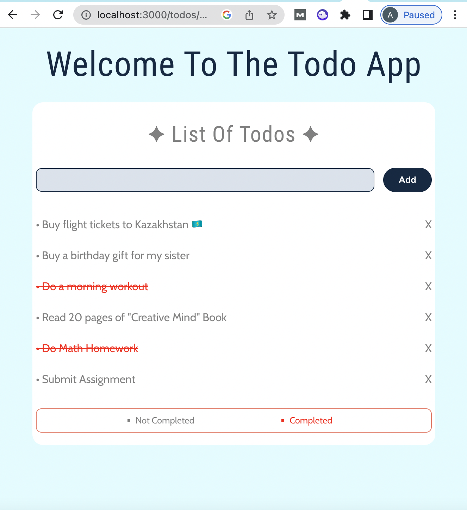

## MERN Project: TodoList

## Front of the App

<p>
  
</p>

1. Setup React Application
2. Remove BoilerPlate
3. Title and Fave Icon
4. Normalize.css and global styles

- https://undraw.co

5. Structure the index.js
6. Create the components: Form, Key, etc & styles.js for every component
7. Create Form and add it to ToDo component
8. Since we need value of the input, change Input in form:

```
<Input value='' type='text' role='input' />
```

9. Change button type to submit

```
<Button type='submit'>
```

10. Change stylings
11. Develop express app

- pass const port = process.env.PORT to listen to whatever is in env Port variable. If you pass 3000 hard-coded to app.listen(), you're always listening on port 3000, which might be just for you, or not, depending on your requirements and the requirements of the environment in which you're running your server.

12. Create .env in backend folder
13. run server

```
node server.js
```

-

Feb, 4

Backend setup and complete:

1. Schema setup in dbTodos.js (what will Todo look like? text, completed/not)
2. API Endpointes, connection to mongodb database w/ mongoose

- now: on the frontend, make api request to the local host of 8000 & the rest of the frontend

---

Feb, 5

- To-do-frontend:

1. Make connection with fetched data from database
2. Use axios

```
npm axios
```

3. Create axios.js in src
4. Create instance with URL
5. Now we have access to URL
6. Create function to fetch all data from db in index.js of Todo in components
7. Fetchdata will save all todos as array
8. Set response data as todos
9. Now we need functions -> we want to run the functions on the first render of the page
10. We have 2 empty todos (checked from console inspect)
11. Use UseEffect hook to fetch data on render
12. Check on network headers -> empty array
13. Add addtodo
14. Change Form: send input as an event to addTodo

```
onSubmit = addtodo
```

15. Prevent default -> prevent screen refreshing

- Check -> click add and see console

16. Now we need to pass input to mongodb

- if input.length === 0 -> dont pass to db
- if input.length > 1

- Post todo, fetch data
- Set input to empty

17. Checked post request: saves in array with created at and completed state
18. Now: create a todo list component and display
19. Create row, text -> render them out
20. Render the todoList in Todo index.js
21. Fetch data
22. Set Todos = response.data
23. Pass Todos as props to TodoList to render it
24. Try text rendering in the page

- For each todo with unique id -> show text
- Now: when we click at text element -> update todo
- When we click on basket: delete todo

25. Get response for id
26. Fetch data to change state
27. Change styles

- Learned:

1. axios
2. port change
3. different between === and == in js
4. async functions
5. useEffect

#### Current issue: cannot delete by ID
